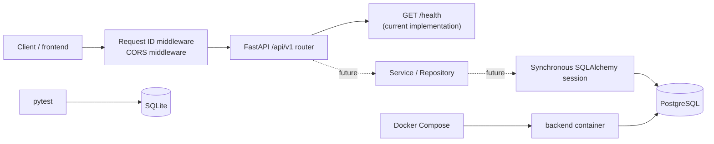

# 아키텍처

## 범위

이 문서는 현재 `feat/backend-foundation`의 실제 구현을 설명한다. 백엔드는
기반 구조와 `GET /api/v1/health`만 제공한다. 연구실 검색, 프로필, 관심,
일정, 문서 업로드·분석, 추천, 이메일 초안, 크롤링, OpenAI 연동과 프론트 API
통합은 아직 구현되지 않았다. 해당 기능의 목표 API는 `API_CONTRACT.md`에만
정의되어 있다.

## 모노레포와 경계

```text
.
├── frontend/                 # Lovable React/TypeScript UI와 mock 상태
├── backend/
│   ├── app/                  # FastAPI, 설정, DB, 모델, 스키마
│   ├── migrations/           # Alembic 환경과 초기 migration
│   ├── scripts/              # 명시적인 fixture seed 명령
│   └── tests/                # SQLite 기반 독립 pytest
├── docs/                     # 계약, 스키마, 운영·설계 문서
├── docker-compose.yml        # backend + PostgreSQL 개발 구성
└── .github/workflows/        # backend CI
```

- `frontend/`는 화면, Lovable UI, fixture/mock 데이터를 소유한다. 이 단계에서
  백엔드는 이를 읽는 근거로만 사용하며 수정하거나 실제 데이터로 승격하지 않는다.
- `backend/`는 HTTP API, 설정, 영속성, migration, 테스트를 소유한다. 서버 전용
  환경변수와 향후 OpenAI 키는 backend 실행 환경에서만 읽는다.
- 프론트-백엔드 연결 대상과 순서는 `FRONTEND_BACKEND_MAPPING.md`에 정의한다.
  현재 프론트는 API를 호출하지 않으며 mock 상태를 계속 사용한다.

## 요청과 배포 구조



현재 실제 요청 경로는 `Client → request ID middleware → /api/v1 router → health`
이다. `services/`와 `repositories/` 패키지는 후속 리소스 API를 위한 경계만
준비돼 있으며 아직 비즈니스 로직이나 DB 조회를 구현하지 않았다.

## FastAPI 애플리케이션

- 시작 지점은 `backend/app/main.py`의 모듈 전역 `app = create_app()`이다.
  로컬과 Docker 모두 `uvicorn app.main:app`으로 실행한다.
- `create_app(settings=None)`은 테스트에서 명시적인 `Settings`를 주입할 수 있는
  애플리케이션 팩토리다. FastAPI 제목, 버전, OpenAPI 경로를 구성한다.
- v1 router는 `app/api/v1/router.py`에서 조립되고 `/api/v1` prefix로 등록된다.
  현재 `/api/v1/health`만 있으며 응답은
  `{ "status": "ok", "service": "ddacksaeu-backend", "version": "..." }`다.
- OpenAPI JSON, Swagger UI, ReDoc은 각각 `/api/v1/openapi.json`,
  `/api/v1/docs`, `/api/v1/redoc`이다.

## 설정과 공통 HTTP 인프라

`app/core/config.py`의 Pydantic `Settings`는 `env_file=None`으로 구성되어
프로세스 환경변수만 읽는다. 루트 `.env.example`은 값의 예시이고 앱이 직접
로드하지 않는다. Docker Compose는 자체 변수 보간을 위해 untracked `.env`를
사용할 수 있다.

| 변수 | 기본값 | 용도 |
| --- | --- | --- |
| `APP_ENV` | `development` | `development`, `test`, `production` 구분 |
| `BACKEND_HOST` | `127.0.0.1` | 실행 명령의 bind host |
| `BACKEND_PORT` | `8000` | 실행 명령의 port |
| `DATABASE_URL` | SQLite URL | 로컬/테스트 또는 PostgreSQL 연결 |
| `CORS_ORIGINS` | 개발 시 localhost:5173 | 쉼표 구분 허용 origin |
| `LOG_LEVEL` | `INFO` | JSON 구조화 로그 레벨 |

- request ID middleware는 요청마다 UUID를 생성하거나 전달받은
  `X-Request-ID`를 사용하고, 응답 헤더와 구조화된 request log에 넣는다.
- `JsonFormatter`는 UTC timestamp, level, logger, message, request ID를 JSON으로
  기록한다.
- Starlette HTTP 오류, Pydantic 검증 오류, 처리되지 않은 예외는 각각 공통
  `{ "error": { "code": "...", "message": "..." } }` 형식으로 응답한다.
  외부 응답에는 stack trace를 포함하지 않는다.
- CORS origin이 비어 있으면 middleware를 등록하지 않는다. development는
  `http://localhost:5173`만 기본 허용하며, test/production은 기본 허용 origin이
  없고 wildcard `*`를 거부한다.

## 데이터베이스와 migration

`app/db/base.py`는 SQLAlchemy declarative `Base`와 UTC timestamp helper를,
`app/db/session.py`는 동기 `Engine`, `sessionmaker`, FastAPI 의존성
`get_db_session()`을 제공한다. SQLite 연결에는 foreign key PRAGMA와
`check_same_thread=False`를 적용하고, 다른 URL은 PostgreSQL을 포함한 기본
SQLAlchemy 동기 engine으로 생성한다.

현재 초기 Alembic migration은 다음 MVP 테이블을 생성한다.

- `users`, `user_profiles`
- `labs`, `lab_facts`, `papers`
- `favorites`, `calendar_events`
- `uploaded_documents`, `document_analyses`

PostgreSQL 전용 타입 대신 문자열 ID, 공통 `JSON`, `Date`, timezone-aware
`DateTime`을 사용해 SQLite와 PostgreSQL 호환 범위를 유지한다. 애플리케이션은
시작 시 `create_all()`을 호출하지 않는다.

```text
DATABASE_URL
  └─ alembic upgrade head
       └─ migrations/env.py loads Base.metadata and initial schema
            └─ database schema is ready
                 └─ python -m scripts.seed (optional fixture data)
```

`migrations/env.py`는 `DATABASE_URL`이 있으면 Alembic 설정을 덮어쓴다. Docker
container는 Uvicorn 시작 전 `alembic upgrade head`를 실행한다. pytest는 임시
SQLite database에서 upgrade와 downgrade를 모두 검증한다.

## 테스트와 fixture seed

- pytest fixture는 독립된 in-memory SQLite engine과 `Base.metadata.create_all()`을
  사용한다. PostgreSQL, OpenAI, 외부 네트워크를 요구하지 않는다.
- 테스트 범위는 health 응답·오류·request ID, Settings, SQLite session, Alembic
  upgrade/downgrade, fixture seed 재실행 안전성이다.
- `python -m scripts.seed`는 migration 이후 실행한다. `demo-user`,
  `fixture-vision-lab` 등 안정적인 ID가 있을 때만 insert하므로 반복 실행해도
  행 수가 무한히 증가하지 않는다.
- seed 데이터는 `Fixture` 이름, `origin="fixture"`, `example.invalid` source URL로
  명시하며 실제 학교, 교수, 이메일, 논문을 주장하지 않는다.

## Docker Compose와 CI

`docker-compose.yml`은 두 서비스를 제공한다.

- `db`: `postgres:16-alpine`, named volume `postgres_data`, `pg_isready`
  healthcheck. 비밀번호는 `POSTGRES_PASSWORD` 환경변수에서만 받는다.
- `backend`: `backend/Dockerfile`로 build하고 PostgreSQL `DATABASE_URL`을 주입한다.
  db healthcheck 이후 시작하며 `/api/v1/health` healthcheck를 사용한다.

GitHub Actions `backend-ci.yml`은 Python 3.12에서 backend 의존성을 설치하고,
Ruff format check, Ruff lint, pytest, `alembic upgrade head`를 SQLite URL로 실행한다.
CI는 OpenAI 키나 외부 DB를 요구하지 않는다.

## 현재 기능과 다음 단계

| 현재 구현 | 아직 구현되지 않음 |
| --- | --- |
| 앱 팩토리, health API, OpenAPI, 설정, CORS, request ID, JSON 오류/로그 | 계약의 연구실·프로필·관심·일정 리소스 API |
| 동기 SQLAlchemy 모델, session 경계, initial migration | repository/service CRUD 구현과 프론트 API 통합 |
| SQLite 테스트, PostgreSQL Docker 구성, idempotent fictional seed | 실제 파일 업로드·CV 분석·추천·이메일 초안 |
| 환경변수 기반 실행과 backend CI | 크롤러, OpenAI 호출, 인증/권한, 외부 스토리지, 비동기 큐 |

동기 SQLAlchemy와 SQLite 테스트는 해커톤 MVP의 작은 CRUD 범위에서 오류 경계와
테스트를 단순하게 유지한다. PostgreSQL, Alembic, 명시적인 모델 경계는 실제
운영 데이터와 기능 API를 추가할 때의 이관 경로를 제공한다. Redis, Celery,
Kubernetes, 메시지 큐는 실제 병목이 확인될 때까지 도입하지 않는다.
## Database layer extension (implemented 2026-07-18)

The backend still exposes only the health route. Its synchronous SQLAlchemy
data foundation now supports normalized university, department, professor,
keyword, recommendation, crawl-provenance, and admission-event records. The
new tables are created only by Alembic revision `20260718_0002`; application
startup does not call `create_all()`. Future search, recommendation, and crawl
APIs must use this data layer through repositories or services rather than
accessing frontend mock data.
